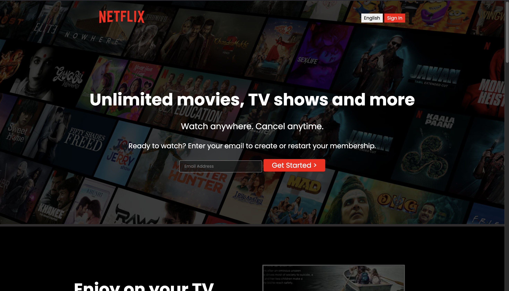

# Netflix Clone

This is a simple Netflix clone built using HTML and CSS. The project showcases a responsive design and aims to replicate the look and feel of the Netflix homepage.

## Features

- **Responsive Design**: Adapts to different screen sizes.
- **Clean UI**: Mimics the Netflix interface.
- **Hover Effects**: Interactive elements with hover effects.

## Technologies Used

- HTML
- CSS

## Installation

1. Clone the repository:
   ```bash
   git clone https://github.com/youruesrname/NETFLIX.git

2. Navigate to the project directory:
   cd NETFLIX
Open index.html in your web browser to view the project.
Usage
Feel free to explore the code and modify it to your liking. This project is a great starting point for learning web development.
## Screenshot



License
This project is open-source and available under the MIT License.

Acknowledgements
Inspired by the original Netflix design.
Thanks to online resources and tutorials that helped in the development of this project.

### Instructions:

1. Replace `yourusername` in the clone URL with your actual GitHub username.
2. Add an actual screenshot of your project where indicated.
3. Modify any sections to better fit your project or preferences.

